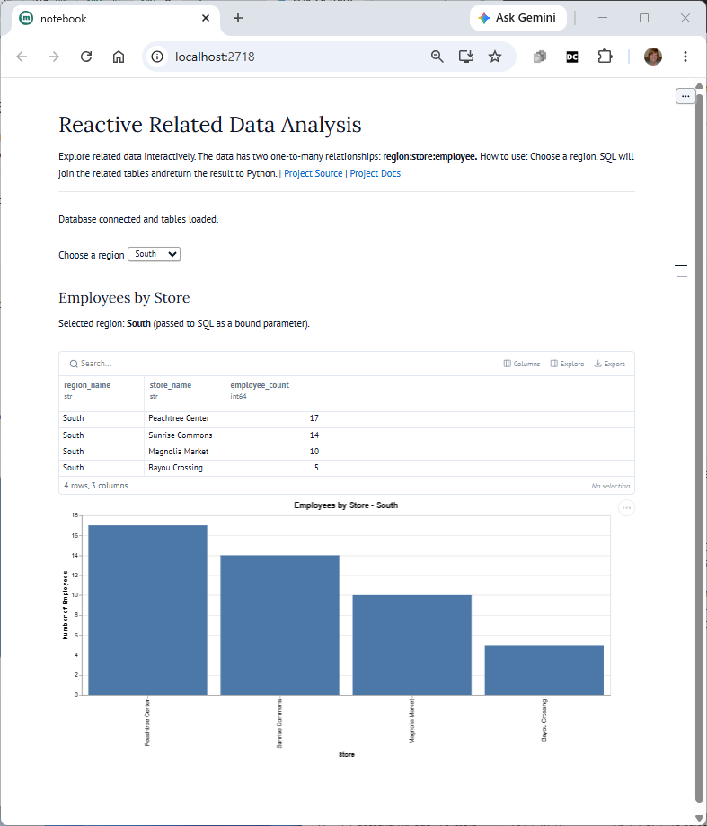

# datafun-05-sql

[](https://denisecase.github.io/pro-analytics-02/workflow-b-apply-example-project/)
[](./pyproject.toml)
[](https://docs.astral.sh/uv/)
[](https://docs.astral.sh/ty/)
[](https://docs.marimo.io/)
[](https://www.sqlite.org/)
[](https://zensical.org/)
[](./LICENSE)

> Professional Python project: relational data and SQL analytics with a marimo app
> for parameterized queries (e.g. choose a region to update the chart)

Notebooks combine narration and code.
This project works on **related tabular data files** using SQL and Python.
It includes a reactive marimo app for interacting with the related data.

## Health Data Insights & SQL Queries

The ETL pipeline loads structured health data into a local SQLite database (`health.sqlite`), enabling efficient relational querying across multiple tables.

### Key Query Example: Unique Patients per Clinic Location
To analyze patient distribution across clinics, the pipeline performs an aggregation query using table aliases for clean join syntax:

```sql
  SELECT 
        p.patient_id,
        p.age,
        p.age_group,
        c.city,
        c.clinic_name
    FROM patient p
    LEFT JOIN clinics c ON p.clinic_id = c.clinic_id
```
## Health Data Analysis & Interactive Notebooks

The health data pipeline goes beyond static database storage by integrating reactive Python notebooks built with **Marimo** for dynamic data exploration.

### Pipeline Workflow & Features
* **ETL Pipeline:** Ingests raw CSVs (`clinics`, `patients`, `lab_results`, `visits`) into a structured SQLite database (`health.sqlite`).
* **Relational Querying:** Aggregates unique patient counts per clinic location using clean SQL joins and filtering.
* **Reactive Notebooks:** Utilizes Marimo notebooks to analyze health dataset characteristics using interactive UI components like sliders.
* **Automated Visualizations:** Renders custom-styled charts and saves assets directly to `docs/images/` for repository documentation.

## Produced Artifacts

- [**Reactive App (marimo)**]([https://github.com/rlorey/datafun-05-sql/blob/main/src/datafun/clinic_analysis.py])
  - run the analysis interactively in a browser

- [**Reactive Notebook (marimo)**](./src/datafun/notebook.py)
  - view the Python source used to create the reactive app

## Initial Results




## Important Folders and Files

- **data/*** - raw CSV input files
- **artifacts/** - generated database files, logs, or reports
- **docs/** - project narrative and documentation
- **src/datafun/** - project logic
- **zensical.toml** - update documentation site metadata

## Common Workflow

Follow the
[step-by-step workflow guide](https://denisecase.github.io/pro-analytics-02/workflow-b-apply-example-project/)
carefully.

## Challenges

Challenges are expected.
Sometimes instructions may not quite match your operating system.
When issues occur, share screenshots, error messages,
and details about what you tried.
Working through issues is part of implementing professional projects.

## Success

After completing Phase 1. **Start & Run**, you'll have the example project,
running on your machine.
A new file `project.log` will appear in the root project folder
and running the example script will print out:

```shell
===================================
END main() - Executed successfully!
===================================
```

## Command Reference

The commands below are used in the workflow guide above.
They are provided here for convenience.

Follow the guide for the **full instructions**.

<details>
<summary>Show command reference</summary>

### In a machine terminal (open in your `Repos` folder)

Open a machine terminal in your `Repos` folder,
change directory (cd) into the new folder,
and run `code .` to open only this example project in VS Code:

```shell
git clone https://github.com/denisecase/datafun-05-sql

cd datafun-05-sql
code .
```

### In a VS Code terminal

These are listed for convenience.
For best results, follow the detailed instructions in
[pro-analytics-02 guide](https://denisecase.github.io/pro-analytics-02/).

Use VS Code menu option `Terminal` / `New Terminal` to open a **VS Code terminal**
in the root project folder.
Copy each command, paste into your terminal, and hit ENTER,
to run each command one at a time.

```shell
uv self update
uv python pin 3.14
uv python install
uv lock --upgrade
uv sync

uv run pre-commit install
uv run pre-commit autoupdate

git add -A
uv run pre-commit run --all-files
# repeat if changes were made by pre-commit tasks
git add -A
uv run pre-commit run --all-files

# run the Python module
uv run python -m datafun.app

# run marimo nb as a reactive app
# press Ctrl + C in the terminal to exit
uv run marimo run src/datafun/notebook.py

# Or: run marimo nb as a notebook
uv run marimo edit src/datafun/notebook.py

# do chores
uv run ruff format .
uv run ruff check . --fix
uv run ty check
uv run python -m pytest
uv run python -m zensical build

# save progress as you work
git add -A
git commit -m "your message here"
# repeat if changes were made (try the UP ARROW)
git add -A
git commit -m "your message here"

git push -u origin main
```

</details>

## Helpful Tips

- Use the **UP ARROW** and **DOWN ARROW** in the terminal
  to scroll through past commands.
- Use `CTRL+f` to find (and replace) text within a file.

## Much Can Be Ignored

- You do not need to add to or modify `tests/`.
  Tests are recommended and provided for example only.
- Many files are silent helpers.
  [Explore](https://denisecase.github.io/professional-python-project-explainer/)
  as you like, but most files are never touched.
- You do NOT need to understand everything;
  let understanding build over time.

## As Needed

If VS Code does not automatically use the new `.venv` environment:

1. Open the Command Palette (`Ctrl+Shift+P`).
2. Run **Python: Select Interpreter**.
3. Select the interpreter from this project's `.venv` folder.

If VS Code still does not recognize the environment or newly installed tools:

1. Open the Command Palette (`Ctrl+Shift+P`).
2. Run **Developer: Reload Window**.

## Troubleshooting >>>

If you see something like this in your terminal: `>>>` or `...`
You accidentally started Python interactive mode.
It happens.
Press `Ctrl c` (both keys together) or `Ctrl+Z` then `Enter` on Windows.

## Documentation

- [Documentation](https://denisecase.github.io/datafun-05-sql/)

## Data Card

- [Palmer Penguins Data Card](./docs/data-card.md)

## Annotations

- [.annotations/annotations.md](./.annotations/annotations.md)

## Citation

- [CITATION.cff](./CITATION.cff)

## License

This project is licensed under the [MIT License](./LICENSE).
