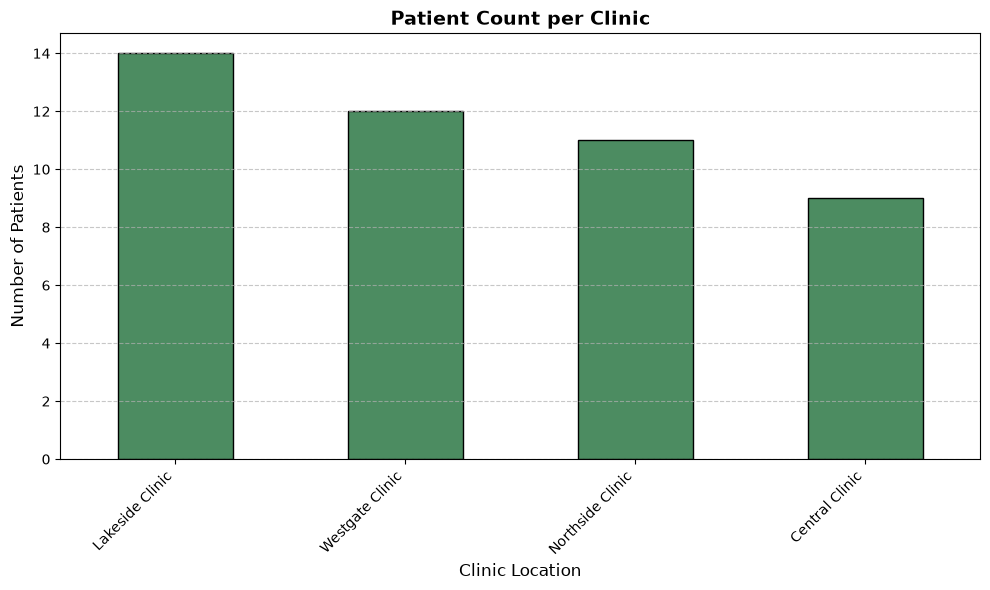

# datafun-05-sql

[](./pyproject.toml)
[](https://docs.astral.sh/uv/)
[](https://docs.astral.sh/ty/)
[](https://docs.marimo.io/)
[](https://www.sqlite.org/)
[](https://zensical.org/)
[](./LICENSE)

## About the Project

This project implements a complete **Extract, Transform, Load (ETL)** pipeline and reactive analytics dashboard designed for health data management. It bridges traditional relational database operations with modern, browser-capable interactive data exploration.

### Key Highlights
* **Relational Database Engineering:** Ingests raw structured health data (`clinics`, `patients`, `lab_results`, `visits`) into a robust local SQLite database (`health.sqlite`).
* **Advanced Querying & Aggregation:** Executes precise SQL queries using table aliases and joins to analyze metrics such as unique patient distributions across clinic locations.
* **Interactive Reactive Notebooks:** Incorporates **Marimo** (`clinic_analysis.py`) to provide dynamic UI components, sliders, and real-time data filtering.
* **Reproducible Documentation:** Features clickable workflow links, automated asset generation, and browser-executable Marimo previews to ensure seamless sharing and evaluation.

### Key Query Example: Unique Patients per Clinic Location
To analyze patient distribution across clinics, the pipeline performs an aggregation query using table aliases for clean join syntax:

```sql
  SELECT 
        p.patient_id,
        p.age,
        p.age_group,
        c.city,
        c.clinic_name
    FROM patient p
    LEFT JOIN clinics c ON p.clinic_id = c.clinic_id
```

## Produced Artifacts

[](https://marimo.app/github.com/rlorey/datafun-05-sql/raw/main/src/datafun/clinic_analysis.py)
  - run the analysis interactively in a browser

- [**Reactive Notebook (marimo)**](https://github.com/rlorey/datafun-05-sql/blob/main/src/datafun/clinic_analysis.py))
  - view the Python source used to create the reactive app

## Initial Results




## Important Folders and Files

- **data/*** - raw CSV input files
- **artifacts/** - generated database files, logs, or reports
- **docs/** - project narrative and documentation
- **src/datafun/** - project logic
- **zensical.toml** - update documentation site metadata


## Success

After completing Phase 1. **Start & Run**, you'll have the example project,
running on your machine.
A new file `project.log` will appear in the root project folder
and running the example script will print out:

```shell
===================================
END main() - Executed successfully!
===================================
```

## Command Reference

The commands below are used in the workflow guide above.
They are provided here for convenience.

Follow the guide for the **full instructions**.

<details>
<summary>Show command reference</summary>

### In a machine terminal (open in your `Repos` folder)

Open a machine terminal in your `Repos` folder,
change directory (cd) into the new folder,
and run `code .` to open only this example project in VS Code:

```shell
git clone https://github.com/denisecase/datafun-05-sql

cd datafun-05-sql
code .
```

### In a VS Code terminal

These are listed for convenience.
For best results, follow the detailed instructions in
[pro-analytics-02 guide](https://denisecase.github.io/pro-analytics-02/).

Use VS Code menu option `Terminal` / `New Terminal` to open a **VS Code terminal**
in the root project folder.
Copy each command, paste into your terminal, and hit ENTER,
to run each command one at a time.

```shell
uv self update
uv python pin 3.14
uv python install
uv lock --upgrade
uv sync

uv run pre-commit install
uv run pre-commit autoupdate

git add -A
uv run pre-commit run --all-files
# repeat if changes were made by pre-commit tasks
git add -A
uv run pre-commit run --all-files

# run the Python module
uv run python -m datafun.app

# run marimo nb as a reactive app
# press Ctrl + C in the terminal to exit
uv run marimo run src/datafun/notebook.py

# Or: run marimo nb as a notebook
uv run marimo edit src/datafun/notebook.py

# do chores
uv run ruff format .
uv run ruff check . --fix
uv run ty check
uv run python -m pytest
uv run python -m zensical build

# save progress as you work
git add -A
git commit -m "your message here"
# repeat if changes were made (try the UP ARROW)
git add -A
git commit -m "your message here"

git push -u origin main
```

</details>

## Helpful Tips

- Use the **UP ARROW** and **DOWN ARROW** in the terminal
  to scroll through past commands.
- Use `CTRL+f` to find (and replace) text within a file.

## As Needed

If VS Code does not automatically use the new `.venv` environment:

1. Open the Command Palette (`Ctrl+Shift+P`).
2. Run **Python: Select Interpreter**.
3. Select the interpreter from this project's `.venv` folder.

If VS Code still does not recognize the environment or newly installed tools:

1. Open the Command Palette (`Ctrl+Shift+P`).
2. Run **Developer: Reload Window**.

## Troubleshooting >>>

If you see something like this in your terminal: `>>>` or `...`
You accidentally started Python interactive mode.
It happens.
Press `Ctrl c` (both keys together) or `Ctrl+Z` then `Enter` on Windows.

## Documentation

- [Documentation](https://rlorey.github.io/datafun-05-sql/)


## Annotations

- [.annotations/annotations.md](./.annotations/annotations.md)

## Citation

- [CITATION.cff](./CITATION.cff)

## License

This project is licensed under the [MIT License](./LICENSE).
