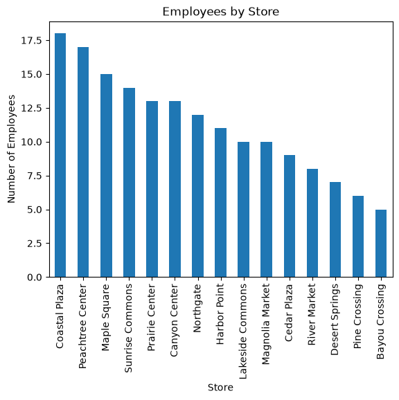

# Project Documentation

> Use this hosted documentation site to tell your
> data story. Include a narrative telling your
> results, observations, and interpretations.
> Display visuals as needed for a compelling story.

## Professional Workflow

See [**Workflow B: Apply Example Project**](https://denisecase.github.io/pro-analytics-02/workflow-b-apply-example-project/)
to get a project like this running on your machine.

## Documentation Index

- **Home** - this landing page
- [**Project Instructions**](./project-instructions.md)
- [**Concepts**](./concepts.md)
- [**Data Card**](./data-card.md)
- [**API**](./api.md)

## Initial Results

After reviewing the related tables in your chosen domain,
use the code in the **src/datafun**
folder to get them in a database so we can use SQL to
join and query the related tables.

## Produced Artifacts

This project produces the same results in several useful forms.

- [**Reactive App (marimo)**](https://denisecase.github.io/datafun-05-sql/app/)
  - run the analysis interactively in a browser
